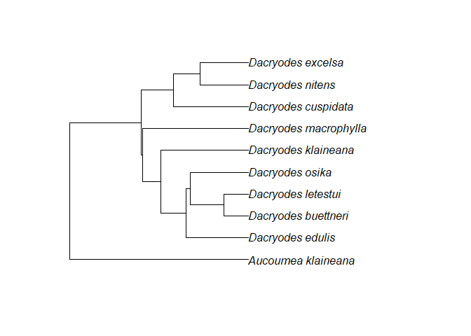
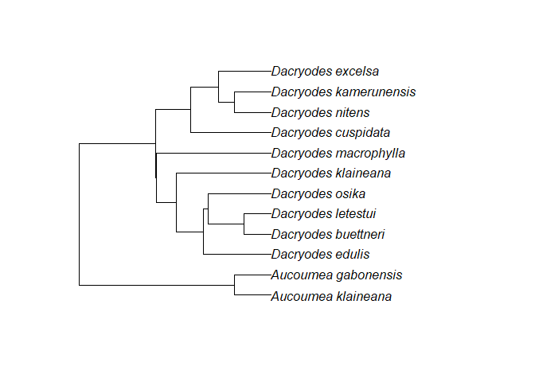
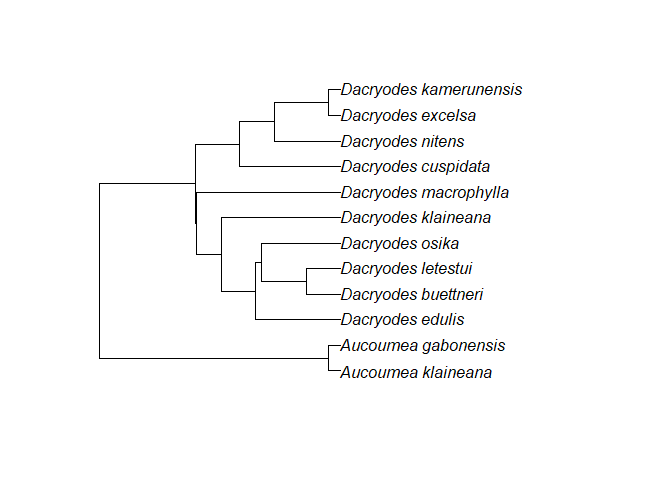

This repository contains the R package spacodiR which was removed from
CRAN.

Some functions were removed as they were not used or necessary for the
key function `spacodi.calc` used to compute various metrics of
phylogenetic/functional community structures.

Functions were written by JE Eastman, Tim CE Paine, OJ Hardy, G Dauby.

Computations of various statistics rely on C code also found in an
executable software that can be found in the following link:

<https://ebe.ulb.ac.be/ebe/SPACoDi.html>

The package can be installed by the following code

`install.packages("devtools")`

`devtools::install_github("gdauby/spacodiR@main")`

# A new function for adding missing species to a phylogeny

In addition to the original package, **a new function** has been added
`add_species_to_genera` which allow adding species to a phylogeny if the
genus is present in the phylogeny.

``` r
data("subset_phy")
library(ape)

plot(subset_phy)
```

<!-- -->

``` r
species_to_match <- c("Dacryodes nitens", "Dacryodes kamerunensis", "Aucoumea gabonensis")

updated_phylo <- add_species_to_genera(specieslist = gsub(" ", "_", species_to_match), phy =  subset_phy)
```

    ## 1 species already present, 0 species without matching genus (not added), 2 species to add now to the tree:

``` r
plot(updated_phylo$phylo)
```

<!-- -->

By default the branch length given to the added species cannot be higher
than 20 But this can be changed with the argument
`threshold_upper_branch`.

``` r
updated_phylo <- add_species_to_genera(specieslist = gsub(" ", "_", species_to_match), phy =  subset_phy, threshold_upper_branch = 5)
```

    ## 1 species already present, 0 species without matching genus (not added), 2 species to add now to the tree:

``` r
plot(updated_phylo$phylo)
```

<!-- -->

More information on the statistical framework of this package can be
found in the following articles:

A formal description of the methods  
**HARDY OJ and B SENTERRE. 2007. Characterizing the phylogenetic
structure of communities by an additive partitioning of phylogenetic
diversity. Journal of Ecology 95:493-506**

Statistical properties of the approach and permutation tests  
**HARDY OJ. 2008. Testing the spatial phylogenetic structure of local
communities: statistical performances of different null models and test
statistics on a locally neutral community. Journal of Ecology
96:914-926**

Additional details on the interpretation  
**HARDY OJ and L JOST. 2008. Interpreting and estimating measures of
community phylogenetic structuring. Journal of Ecology 96:849-852**

A presentation of the original package  
**EASTMAN JE, Paine TCE, Hardy OJ 2011 spacodiR: structuring of
phylogenetic diversity in ecological communities. Bioinformatics, Volume
27, Issue 17, 1 September 2011, Pages 2437–2438**
